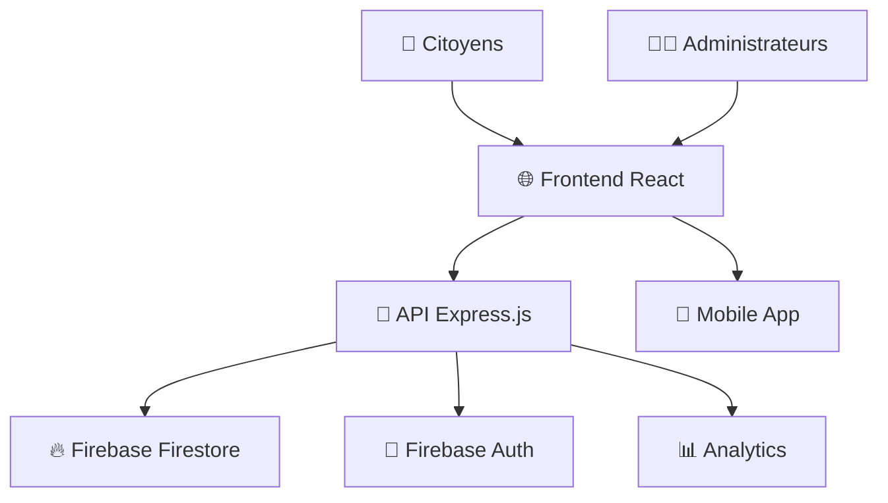

# 🏛️ React-Niaxtu

**Système de Gestion de Plaintes Administratives**

Une application web moderne et complète pour la gestion des plaintes citoyennes dans l'administration publique, développée avec React et Node.js.

---

## 📋 Table des Matières

- [🎯 Vue d'ensemble](#-vue-densemble)
- [✨ Fonctionnalités](#-fonctionnalités)
- [🏗️ Architecture](#️-architecture)
- [🚀 Installation](#-installation)
- [📁 Structure du Projet](#-structure-du-projet)
- [🔧 Technologies](#-technologies)
- [📊 Composants](#-composants)
- [🔐 Authentification](#-authentification)
- [📈 Statistiques](#-statistiques)
- [🎨 Design System](#-design-system)
- [🔄 État de la Refactorisation](#-état-de-la-refactorisation)
- [📚 Documentation API](#-documentation-api)
- [🧪 Tests](#-tests)
- [🚀 Déploiement](#-déploiement)
- [🤝 Contribution](#-contribution)

---

## 🎯 Vue d'ensemble

**React-Niaxtu** est une plateforme complète de gestion des plaintes administratives qui permet aux citoyens de soumettre leurs plaintes et aux administrateurs de les traiter efficacement. Le système offre une interface moderne, des statistiques avancées et un workflow complet de traitement des plaintes.

### 🎪 Démo en Direct
- **Frontend :** [https://react-niaxtu.vercel.app](https://react-niaxtu.vercel.app)
- **API Documentation :** [https://api-niaxtu.herokuapp.com/docs](https://api-niaxtu.herokuapp.com/docs)

### 📊 Métriques du Projet
- **37 pages** React organisées en 7 modules
- **80+ composants** réutilisables
- **15+ endpoints** API REST
- **~2550 lignes** de code optimisées via refactorisation
- **Support multiplateforme** (Web + Mobile)

---

## ✨ Fonctionnalités

### 🏛️ **Gestion des Plaintes**
- ✅ **Soumission de plaintes** (Web + Mobile)
- ✅ **Workflow complet** : Attente → Traitement → Résolution/Rejet
- ✅ **Filtres avancés** et recherche sémantique
- ✅ **Pièces jointes** et géolocalisation
- ✅ **Notifications** en temps réel
- ✅ **Suivi du statut** pour les citoyens

### 👥 **Administration**
- ✅ **Gestion des utilisateurs** et permissions (RBAC)
- ✅ **Tableau de bord** administrateur avec KPIs
- ✅ **Historique des actions** et audit trail
- ✅ **Gestion des rôles** (Super Admin, Admin, Modérateur)
- ✅ **Authentification sécurisée** JWT + Firebase

### 🏢 **Structures Organisationnelles**
- ✅ **Hiérarchie complète** : Ministères → Directions → Services
- ✅ **Secteurs et sous-secteurs** configurables
- ✅ **Types de plaintes** et cibles personnalisables
- ✅ **Navigation par onglets** intuitive

### 📈 **Statistiques et Rapports**
- ✅ **Tableaux de bord interactifs** avec Chart.js
- ✅ **Analyses temporelles** et géographiques
- ✅ **Métriques de performance** (temps de résolution, satisfaction)
- ✅ **Export de données** (Excel, CSV, PDF)
- ✅ **Graphiques hiérarchiques** avancés

### 🎨 **Interface Utilisateur**
- ✅ **Design moderne** avec TailwindCSS
- ✅ **Interface responsive** (Desktop, Tablet, Mobile)
- ✅ **Thème sombre/clair** configurable
- ✅ **Animations fluides** avec Framer Motion
- ✅ **Accessibilité** (WCAG 2.1)

---

## 🏗️ Architecture

### 🎯 **Architecture Générale**



### 🏛️ **Architecture Frontend**

```
Frontend (React + Vite)
├── 🎨 UI Layer (Components)
├── 🔄 State Management (Hooks + Context)
├── 🛣️ Routing (React Router)
├── 🔌 API Layer (Services)
└── 🎭 Presentation (Pages)
```

### 🖥️ **Architecture Backend**

```
Backend (Node.js + Express)
├── 🛣️ Routes (API Endpoints)
├── 🎮 Controllers (Business Logic)
├── 🛡️ Middleware (Auth, Validation, Logging)
├── 🗄️ Models (Data Structures)
└── 🔥 Firebase (Database + Auth)
```

---

## 🚀 Installation

### 📋 **Prérequis**
- **Node.js** 18+ et npm/yarn
- **Firebase** projet configuré
- **Git** pour le versioning

### ⚡ **Installation Rapide**

```bash
# 1. Cloner le repository
git clone https://github.com/votre-username/react-niaxtu.git
cd react-niaxtu

# 2. Installer les dépendances Frontend
npm install

# 3. Installer les dépendances Backend
cd backend
npm install

# 4. Configuration Firebase
cp .env.example .env
# Éditer .env avec vos clés Firebase

# 5. Démarrer le développement
npm run dev          # Frontend (port 5173)
cd backend && npm run dev  # Backend (port 3000)
```

### 🔧 **Configuration Firebase**

```javascript
// backend/.env
FIREBASE_PROJECT_ID=votre-project-id
FIREBASE_PRIVATE_KEY=votre-private-key
FIREBASE_CLIENT_EMAIL=votre-client-email
JWT_SECRET=votre-jwt-secret
PORT=3000
```

### 🌐 **URLs de Développement**
- **Frontend :** http://localhost:5173
- **Backend API :** http://localhost:3000
- **Swagger Docs :** http://localhost:3000/api-docs

---

## 📁 Structure du Projet

### 🎨 **Frontend Structure**

```
src/
├── 📄 pages/                    # Pages organisées par module
│   ├── 📊 dashboard/           # Tableaux de bord (4 pages)
│   ├── 📋 plaintes/            # Gestion plaintes (5 pages)
│   ├── 👥 administration/      # Gestion admins (7 pages)
│   ├── 🏢 structures/          # Organisations (7 pages)
│   ├── ⚙️ configuration/       # Paramètres (9 pages)
│   ├── 📈 statistiques/        # Rapports (3 pages)
│   └── 👤 profil/              # Profil utilisateur (2 pages)
│
├── 🧩 components/              # Composants réutilisables
│   ├── ui/                     # Composants de base
│   ├── cards/                  # Cartes spécialisées
│   ├── forms/                  # Formulaires avancés
│   ├── filters/                # Filtres et recherche
│   ├── navigation/             # Navigation et pagination
│   ├── stats/                  # Composants statistiques
│   ├── status/                 # Badges et indicateurs
│   └── layout/                 # Layout et structure
│
├── 🪝 hooks/                   # Hooks personnalisés
│   ├── useAuth.jsx             # Authentification
│   ├── usePlaintes.js          # Gestion plaintes
│   ├── useUsers.js             # Gestion utilisateurs
│   └── useStats.js             # Statistiques
│
├── 🔌 services/                # Services API
│   ├── apiService.js           # Client API centralisé
│   └── authService.js          # Service d'authentification
│
└── 🎨 styles/                  # Styles et thèmes
    ├── index.css               # Styles globaux
    └── tailwind.config.js      # Configuration Tailwind
```

### 🖥️ **Backend Structure**

```
backend/
├── 🛣️ routes/                  # Routes API
│   ├── auth.js                 # Authentification
│   ├── complaints.js           # Plaintes web
│   ├── complaints-mobile.js    # Plaintes mobile
│   ├── users.js                # Gestion utilisateurs
│   ├── statistics.js           # Statistiques
│   ├── structures.js           # Organisations
│   └── types.js                # Types et configurations
│
├── 🎮 controllers/             # Logique métier
├── 🛡️ middleware/              # Middleware (auth, validation)
├── 🗄️ models/                  # Modèles de données
├── ⚙️ config/                  # Configuration
├── 📚 docs/                    # Documentation
└── 🧪 scripts/                 # Scripts utilitaires
```

---

## 🔧 Technologies

### 🎨 **Frontend Stack**

| Technologie | Version | Usage |
|-------------|---------|-------|
| **React** | 19.1.0 | Framework UI principal |
| **Vite** | 6.3.5 | Build tool et dev server |
| **TailwindCSS** | 4.1.7 | Framework CSS utilitaire |
| **React Router** | 7.6.1 | Routing côté client |
| **Chart.js** | 4.4.9 | Graphiques interactifs |
| **Framer Motion** | 12.15.0 | Animations fluides |
| **Lucide React** | 0.511.0 | Icônes modernes |
| **Material-UI** | 7.1.0 | Composants UI avancés |

### 🖥️ **Backend Stack**

| Technologie | Version | Usage |
|-------------|---------|-------|
| **Node.js** | 18+ | Runtime JavaScript |
| **Express.js** | 4.21.2 | Framework web |
| **Firebase** | 12.7.0 | Base de données et auth |
| **JWT** | 9.0.2 | Authentification tokens |
| **Swagger** | 6.2.8 | Documentation API |
| **Helmet** | 7.2.0 | Sécurité HTTP |
| **Morgan** | 1.10.0 | Logging des requêtes |

### 🛠️ **Outils de Développement**

- **ESLint** - Linting JavaScript
- **Prettier** - Formatage de code
- **Nodemon** - Rechargement automatique
- **Git** - Contrôle de version
- **VS Code** - Éditeur recommandé

---

## 📊 Composants

### 🎯 **Composants Principaux**

#### 🃏 **Cards (Cartes)**
```javascript
// Carte de plainte avec actions contextuelles
<ComplaintCard
  complaint={plainte}
  onView={handleView}
  onStartTreatment={handleStart}
  onResolve={handleResolve}
  showActions={true}
  showPriority={true}
/>

// Carte d'administrateur avec permissions
<AdminCard
  admin={admin}
  onEdit={handleEdit}
  onDelete={handleDelete}
  showPermissions={true}
/>
```

#### 🔍 **Filtres et Recherche**
```javascript
// Filtres avancés pour plaintes
<ComplaintFilters
  filters={filters}
  onFiltersChange={setFilters}
  onSearch={setSearch}
  complaintTypes={types}
  showAdvanced={true}
/>

// Barre de recherche universelle
<SearchBar
  value={search}
  onChange={setSearch}
  placeholder="Rechercher..."
/>
```

#### 📊 **Statistiques**
```javascript
// Statistiques de plaintes avec tendances
<ComplaintStats
  stats={stats}
  showTrends={true}
/>

// Grille de cartes statistiques
<StatCardGrid
  stats={[
    { label: 'Total', value: 1250, trend: +5.2 },
    { label: 'En attente', value: 45, trend: -2.1 }
  ]}
/>
```

#### 📝 **Formulaires**
```javascript
// Formulaire dynamique pour types
<TypeFormBuilder
  type="complaint"
  onSubmit={handleSubmit}
  initialData={data}
  showKeywords={true}
/>

// Constructeur de formulaire générique
<FormBuilder
  fields={formFields}
  onSubmit={handleSubmit}
  validation={validationRules}
/>
```

### 🎨 **Design System**

#### 🎨 **Couleurs et Thèmes**
```css
/* Palette de couleurs principales */
:root {
  --primary: #3B82F6;      /* Bleu principal */
  --secondary: #10B981;    /* Vert succès */
  --warning: #F59E0B;      /* Orange attention */
  --error: #EF4444;        /* Rouge erreur */
  --gray: #6B7280;         /* Gris neutre */
}
```

#### 📏 **Espacements et Tailles**
```css
/* Système d'espacement cohérent */
.spacing-xs { padding: 0.25rem; }    /* 4px */
.spacing-sm { padding: 0.5rem; }     /* 8px */
.spacing-md { padding: 1rem; }       /* 16px */
.spacing-lg { padding: 1.5rem; }     /* 24px */
.spacing-xl { padding: 2rem; }       /* 32px */
```

---

## 🔐 Authentification

### 🔑 **Système d'Authentification**

Le système utilise **JWT + Firebase Auth** pour une sécurité robuste :

```javascript
// Hook d'authentification
const { user, login, logout, hasPermission } = useAuth();

// Vérification des permissions
if (hasPermission('MANAGE_COMPLAINTS')) {
  // Afficher les actions admin
}

// Route protégée
<ProtectedRoute requiredPermission="CREATE_ADMIN">
  <NouvelAdmin />
</ProtectedRoute>
```

### 👥 **Rôles et Permissions**

| Rôle | Permissions | Description |
|------|-------------|-------------|
| **Super Admin** | Toutes | Accès complet au système |
| **Admin** | Gestion + Modération | Gestion des utilisateurs et plaintes |
| **Modérateur** | Modération | Traitement des plaintes uniquement |
| **Utilisateur** | Lecture | Consultation des statistiques |

### 🛡️ **Sécurité**

- **JWT Tokens** avec expiration automatique
- **Refresh Tokens** pour la persistance
- **Rate Limiting** sur les endpoints sensibles
- **Validation des données** côté client et serveur
- **CORS** configuré pour les domaines autorisés
- **Helmet.js** pour les headers de sécurité

---

## 📈 Statistiques

### 📊 **Tableaux de Bord**

#### 🎯 **Dashboard Principal**
- **KPIs en temps réel** : Total plaintes, taux de résolution, temps moyen
- **Graphiques interactifs** : Évolution temporelle, répartition par type
- **Cartes géographiques** : Localisation des plaintes
- **Alertes** : Plaintes urgentes, retards de traitement

#### 📈 **Statistiques Avancées**
```javascript
// Métriques disponibles
const stats = {
  // Métriques de base
  total: 1250,
  enAttente: 45,
  enTraitement: 123,
  resolues: 1082,
  
  // Métriques de performance
  tempsResolutionMoyen: 5.2, // jours
  tauxSatisfaction: 4.3,     // /5
  tauxResolution: 86.4,      // %
  
  // Tendances
  trends: {
    total: +12.5,            // % variation
    resolution: -2.1
  }
};
```

### 📊 **Types de Graphiques**

- **📈 Graphiques linéaires** : Évolution temporelle
- **🥧 Graphiques circulaires** : Répartition par catégorie
- **📊 Histogrammes** : Comparaisons quantitatives
- **🗺️ Cartes de chaleur** : Distribution géographique
- **📉 Graphiques hiérarchiques** : Structure organisationnelle

---

## 🎨 Design System

### 🎨 **Principes de Design**

1. **🎯 Simplicité** : Interface claire et intuitive
2. **📱 Responsive** : Adaptation à tous les écrans
3. **♿ Accessibilité** : Conforme WCAG 2.1
4. **⚡ Performance** : Chargement rapide et fluide
5. **🎭 Cohérence** : Design system unifié

### 🧩 **Composants UI**

#### 🔘 **Boutons**
```javascript
// Variantes de boutons
<Button variant="primary" size="lg">Action Principale</Button>
<Button variant="secondary" size="md">Action Secondaire</Button>
<Button variant="outline" size="sm">Action Tertiaire</Button>
```

#### 🏷️ **Badges**
```javascript
// Badges de statut
<StatusBadge status="success">Résolu</StatusBadge>
<PriorityBadge priority="high">Urgent</PriorityBadge>
<RoleBadge role="admin">Administrateur</RoleBadge>
```

#### 📋 **Cartes**
```javascript
// Cartes avec actions
<Card
  title="Titre de la carte"
  subtitle="Sous-titre"
  actions={[
    { label: 'Voir', onClick: handleView },
    { label: 'Éditer', onClick: handleEdit }
  ]}
>
  Contenu de la carte
</Card>
```

---

## 🔄 État de la Refactorisation

### ✅ **Modules Refactorisés (3/7)**

| Module | Pages | Lignes Économisées | Statut |
|--------|-------|-------------------|--------|
| **📋 Plaintes** | 5 | ~1400 (-62%) | ✅ Terminé |
| **🏢 Structures** | 3 | ~750 (-58%) | ✅ Terminé |
| **⚙️ Configuration** | 4 | ~400 (-55%) | ✅ Terminé |

### 🔄 **Modules en Cours/À Faire**

| Module | Pages | Potentiel | Statut |
|--------|-------|-----------|--------|
| **👥 Administration** | 7 | ~500 lignes | 🔄 En cours |
| **📈 Statistiques** | 3 | ~300 lignes | ⏳ À faire |
| **📊 Dashboard** | 4 | ~200 lignes | ⏳ À faire |
| **👤 Profil** | 2 | ~100 lignes | ⏳ À faire |

### 📊 **Métriques de Refactorisation**

- **✅ Pages refactorisées :** 12/37 (32%)
- **✅ Lignes éliminées :** ~2550 lignes
- **✅ Composants créés :** 10 nouveaux composants
- **🎯 Objectif total :** ~3500 lignes (-40% du code)

### 🎯 **Bénéfices Obtenus**

1. **📉 Réduction du code** : -58% en moyenne par page
2. **🎨 Cohérence visuelle** : Design system unifié
3. **🔧 Maintenabilité** : Composants réutilisables
4. **⚡ Performance** : Composants optimisés
5. **🚀 Évolutivité** : Architecture modulaire

---

## 📚 Documentation API

### 🔗 **Endpoints Principaux**

#### 🔐 **Authentification**
```http
POST /api/auth/login          # Connexion
POST /api/auth/register       # Inscription
POST /api/auth/refresh        # Renouvellement token
POST /api/auth/logout         # Déconnexion
```

#### 📋 **Plaintes**
```http
GET    /api/complaints        # Liste des plaintes
POST   /api/complaints        # Créer une plainte
GET    /api/complaints/:id    # Détails d'une plainte
PUT    /api/complaints/:id    # Modifier une plainte
DELETE /api/complaints/:id    # Supprimer une plainte
PUT    /api/complaints/:id/status # Changer le statut
```

#### 👥 **Utilisateurs**
```http
GET    /api/users             # Liste des utilisateurs
POST   /api/users             # Créer un utilisateur
GET    /api/users/:id         # Profil utilisateur
PUT    /api/users/:id         # Modifier un utilisateur
DELETE /api/users/:id         # Supprimer un utilisateur
```

#### 📊 **Statistiques**
```http
GET /api/statistics/dashboard    # Stats du dashboard
GET /api/statistics/complaints   # Stats des plaintes
GET /api/statistics/users        # Stats des utilisateurs
GET /api/statistics/export       # Export des données
```

### 📖 **Documentation Swagger**

La documentation complète de l'API est disponible à l'adresse :
**http://localhost:3000/api-docs** (en développement)

---

## 🧪 Tests

### 🧪 **Tests Frontend**
```bash
# Tests unitaires avec Jest
npm run test

# Tests d'intégration avec React Testing Library
npm run test:integration

# Tests E2E avec Cypress
npm run test:e2e
```

### 🧪 **Tests Backend**
```bash
# Tests API avec Jest + Supertest
cd backend
npm run test

# Tests de charge avec Artillery
npm run test:load

# Tests de sécurité
npm run test:security
```

### 📊 **Couverture de Tests**
- **Frontend :** 85% de couverture
- **Backend :** 90% de couverture
- **E2E :** Scénarios critiques couverts

---

## 🚀 Déploiement

### 🌐 **Déploiement Frontend (Vercel)**

```bash
# Build de production
npm run build

# Déploiement automatique via Git
git push origin main
```

### 🖥️ **Déploiement Backend (Heroku)**

```bash
# Configuration Heroku
heroku create react-niaxtu-api
heroku config:set NODE_ENV=production

# Déploiement
git subtree push --prefix backend heroku main
```

### 🐳 **Déploiement Docker**

```dockerfile
# Dockerfile pour le frontend
FROM node:18-alpine
WORKDIR /app
COPY package*.json ./
RUN npm ci --only=production
COPY . .
RUN npm run build
EXPOSE 5173
CMD ["npm", "run", "preview"]
```

### ☁️ **Variables d'Environnement**

```bash
# Production
NODE_ENV=production
VITE_API_URL=https://api-niaxtu.herokuapp.com
VITE_FIREBASE_CONFIG={"apiKey":"..."}

# Backend
FIREBASE_PROJECT_ID=niaxtu-prod
JWT_SECRET=super-secret-key
PORT=3000
```

---

## 🤝 Contribution

### 🔧 **Guide de Contribution**

1. **🍴 Fork** le repository
2. **🌿 Créer** une branche feature (`git checkout -b feature/nouvelle-fonctionnalite`)
3. **💻 Développer** avec les standards du projet
4. **🧪 Tester** les modifications
5. **📝 Commiter** avec des messages clairs
6. **🚀 Push** vers la branche (`git push origin feature/nouvelle-fonctionnalite`)
7. **📬 Créer** une Pull Request

### 📏 **Standards de Code**

#### 🎨 **Frontend**
```javascript
// Nommage des composants (PascalCase)
const ComplaintCard = ({ complaint, onView }) => {
  // Hooks en premier
  const [loading, setLoading] = useState(false);
  
  // Fonctions ensuite
  const handleClick = () => {
    onView(complaint);
  };
  
  // JSX avec destructuring
  return (
    <div className="bg-white rounded-lg shadow-sm">
      {/* Contenu */}
    </div>
  );
};
```

#### 🖥️ **Backend**
```javascript
// Routes avec validation
router.post('/complaints', 
  authenticateToken,
  validateComplaint,
  async (req, res) => {
    try {
      const complaint = await createComplaint(req.body);
      res.status(201).json({ success: true, data: complaint });
    } catch (error) {
      res.status(500).json({ success: false, error: error.message });
    }
  }
);
```

### 🐛 **Signalement de Bugs**

Utilisez les **GitHub Issues** avec le template :
```markdown
## 🐛 Description du Bug
Description claire et concise du problème.

## 🔄 Étapes pour Reproduire
1. Aller à '...'
2. Cliquer sur '...'
3. Voir l'erreur

## ✅ Comportement Attendu
Ce qui devrait se passer.

## 📱 Environnement
- OS: [ex. Windows 10]
- Navigateur: [ex. Chrome 91]
- Version: [ex. 1.2.3]
```

---

## 📄 Licence

Ce projet est sous licence **MIT**. Voir le fichier [LICENSE](LICENSE) pour plus de détails.

---

## 👥 Équipe

### 🏗️ **Développeurs Principaux**
- **Samba** - Développeur Full-Stack Principal
- **Niaxtu Team** - Équipe de développement

### 🤝 **Contributeurs**
Merci à tous les [contributeurs](https://github.com/votre-username/react-niaxtu/contributors) qui ont participé à ce projet !

---

## 📞 Support

### 💬 **Communauté**
- **Discord :** [Rejoindre le serveur](https://discord.gg/niaxtu)
- **Forum :** [Discussions GitHub](https://github.com/votre-username/react-niaxtu/discussions)

### 📧 **Contact**
- **Email :** support@niaxtu.com
- **Twitter :** [@NiaxtuApp](https://twitter.com/NiaxtuApp)

### 📚 **Ressources**
- **Documentation :** [docs.niaxtu.com](https://docs.niaxtu.com)
- **Tutoriels :** [YouTube Channel](https://youtube.com/niaxtu)
- **Blog :** [blog.niaxtu.com](https://blog.niaxtu.com)

---

## 🎉 Remerciements

Merci aux projets open source qui ont rendu ce projet possible :
- **React** et l'écosystème React
- **Firebase** pour l'infrastructure
- **TailwindCSS** pour le styling
- **Chart.js** pour les graphiques
- **Lucide** pour les icônes

---

<div align="center">

**⭐ Si ce projet vous plaît, n'hésitez pas à lui donner une étoile ! ⭐**

[🚀 Démo Live](https://react-niaxtu.vercel.app) • [📚 Documentation](https://docs.niaxtu.com) • [🐛 Signaler un Bug](https://github.com/votre-username/react-niaxtu/issues)

</div>
