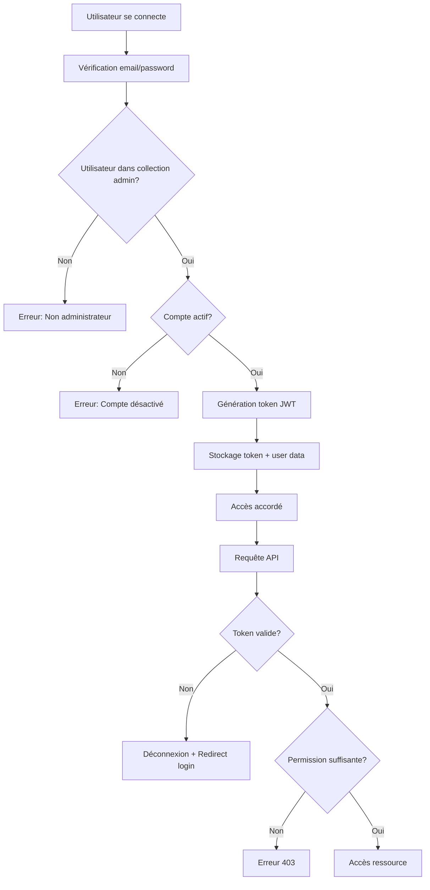

# 🔐 Système d'Authentification Niaxtu - Guide d'Utilisation

## 📋 Vue d'ensemble

Le système d'authentification Niaxtu a été entièrement refactorisé pour offrir une sécurité renforcée et une gestion granulaire des permissions. Il est basé sur les meilleures pratiques décrites dans le `GUIDE_AUTHENTIFICATION_FRONTEND.md`.

## 🏗️ Architecture

### Services
- **`authService`** : Gestion de l'authentification (login, logout, tokens)
- **`apiService`** : Requêtes API sécurisées avec gestion d'erreurs

### Hooks
- **`useAuth`** : Hook React pour l'état d'authentification

### Composants
- **`ProtectedRoute`** : Protection des routes avec permissions/rôles
- **`LoginForm`** : Formulaire de connexion sécurisé

### Constantes
- **`roles.js`** : Définition des rôles et permissions

## 🚀 Utilisation Rapide

### 1. Protéger une Route

```jsx
import ProtectedRoute from '../components/ProtectedRoute';
import { PERMISSIONS } from '../constants/roles';

// Protection par permission
<ProtectedRoute permission={PERMISSIONS.VIEW_USERS}>
  <UsersList />
</ProtectedRoute>

// Protection par rôle
<ProtectedRoute role="admin">
  <AdminPanel />
</ProtectedRoute>
```

### 2. Vérifier les Permissions dans un Composant

```jsx
import { useAuth } from '../hooks/useAuth';
import { PERMISSIONS } from '../constants/roles';

const MyComponent = () => {
  const { hasPermission, isSuperAdmin, user } = useAuth();

  return (
    <div>
      {/* Affichage conditionnel */}
      {hasPermission(PERMISSIONS.CREATE_USERS) && (
        <button>Créer un utilisateur</button>
      )}

      {/* Super admin badge */}
      {isSuperAdmin() && (
        <div className="super-admin-badge">
          🔐 Mode Super Administrateur
        </div>
      )}

      {/* Informations utilisateur */}
      <p>Connecté en tant que : {user?.email}</p>
      <p>Rôle : {user?.role}</p>
    </div>
  );
};
```

### 3. Faire des Requêtes API Sécurisées

```jsx
import { useAuth } from '../hooks/useAuth';

const MyComponent = () => {
  const { apiService } = useAuth();

  const fetchData = async () => {
    try {
      // GET avec paramètres
      const users = await apiService.get('/users/all', { 
        page: 1, 
        limit: 10 
      });

      // POST
      const newUser = await apiService.post('/users', {
        email: 'test@example.com',
        role: 'user'
      });

      // PUT
      const updated = await apiService.put('/users/123', {
        isActive: true
      });

      // DELETE
      await apiService.delete('/users/123');

    } catch (error) {
      // Les erreurs 401/403 sont gérées automatiquement
      console.error('Erreur API:', error.message);
    }
  };

  return <button onClick={fetchData}>Charger les données</button>;
};
```

## 🔑 Hiérarchie des Rôles

1. **`super_admin`** - Accès total sans restriction
2. **`admin`** - Administration générale
3. **`sector_manager`** - Gestion de secteur
4. **`structure_manager`** - Gestion de structure
5. **`moderator`** - Modération
6. **`analyst`** - Analyse de données
7. **`user`** - Utilisateur standard

> ⚠️ **Important** : Le `super_admin` a **TOUJOURS** accès à tout, même sans permissions explicites.

## 🛡️ Permissions Principales

### Utilisateurs
- `view_users` - Voir les utilisateurs
- `create_users` - Créer des utilisateurs
- `edit_users` - Modifier les utilisateurs
- `delete_users` - Supprimer les utilisateurs

### Plaintes
- `view_complaints` - Voir les plaintes
- `manage_complaint_status` - Gérer le statut des plaintes
- `delete_complaints` - Supprimer les plaintes
- `export_complaints` - Exporter les plaintes

### Structures & Secteurs
- `view_structures` - Voir les structures
- `create_structures` - Créer des structures
- `manage_structures` - Gérer les structures
- `view_sectors` - Voir les secteurs
- `create_sectors` - Créer des secteurs

### Administration
- `view_admin_panel` - Accéder au panneau d'administration
- `manage_permissions` - Gérer les permissions
- `export_data` - Exporter les données

## 🔧 Gestion des Erreurs

Le système gère automatiquement :

### Erreur 401 (Non autorisé)
- Déconnexion automatique
- Redirection vers la page de login
- Nettoyage du localStorage

### Erreur 403 (Accès refusé)
- Affichage d'un message d'erreur
- Notification toast (si disponible)
- Log de l'erreur pour debug

### Erreurs Réseau
- Retry automatique pour rate limiting (429)
- Messages d'erreur explicites
- Gestion des timeouts

## 📱 Interface Utilisateur

### Indicateurs Visuels
- Badge Super Admin pour les super administrateurs
- Messages d'erreur contextuels
- Loading states pendant les vérifications
- Boutons/sections masqués selon les permissions

### Messages d'Erreur
- **Permission insuffisante** : Affiche la permission requise
- **Rôle insuffisant** : Compare le rôle actuel vs requis
- **Compte désactivé** : Propose la déconnexion
- **Session expirée** : Redirection automatique

## 🔄 Workflow d'Authentification



## 🧪 Tests et Debug

### Logs Automatiques
```javascript
// Connexion réussie
console.log('Connexion réussie:', {
  email: 'admin@niaxtu.com',
  role: 'admin',
  permissions: 12
});

// Requêtes API
console.log('[API] GET /users/all');
console.log('[API] Réponse 200:', data);

// Erreurs de permission
console.log('Accès refusé - Permission manquante: view_users');
```

### Vérification Manuelle
```javascript
// Dans la console du navigateur
const auth = window.authService;
console.log('Token:', auth.getToken());
console.log('User:', auth.getUser());
console.log('Has permission:', auth.hasPermission('view_users'));
console.log('Is super admin:', auth.isSuperAdmin());
```

## 🔒 Sécurité

### Bonnes Pratiques Implémentées
- ✅ Tokens JWT avec expiration
- ✅ Vérification côté serveur obligatoire
- ✅ Nettoyage automatique des tokens invalides
- ✅ Permissions granulaires
- ✅ Hiérarchie des rôles
- ✅ Protection CSRF
- ✅ Logs d'audit

### Stockage Sécurisé
- Tokens dans `localStorage` (temporaire)
- Pas d'informations sensibles stockées
- Nettoyage automatique à la déconnexion

## 🚨 Dépannage

### Problèmes Courants

**"Session expirée" en boucle**
```javascript
// Vérifier la validité du token
localStorage.removeItem('authToken');
localStorage.removeItem('user');
window.location.reload();
```

**Permissions non reconnues**
```javascript
// Vérifier les permissions utilisateur
const user = JSON.parse(localStorage.getItem('user'));
console.log('Permissions:', user?.permissions);
```

**Erreurs API persistantes**
```javascript
// Vérifier la configuration de l'API
console.log('API Base URL:', import.meta.env.VITE_API_URL);
```

## 📚 Ressources

- **Guide complet** : `GUIDE_AUTHENTIFICATION_FRONTEND.md`
- **Constantes** : `src/constants/roles.js`
- **Services** : `src/services/`
- **Hooks** : `src/hooks/useAuth.jsx`
- **Composants** : `src/components/ProtectedRoute.jsx`

---

**🎯 Le système est maintenant prêt pour une utilisation en production avec une sécurité renforcée !** 